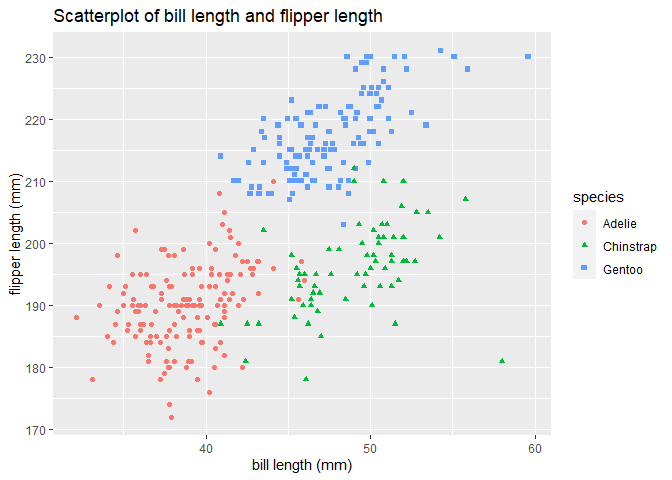

P8105 Homework 1
================
Kyung Suk Lee
2020-09-17

  - [Problem 1](#problem-1)
      - [1-1) Create a data frame with the specified
        elements](#create-a-data-frame-with-the-specified-elements)
      - [1-2) Take the mean of each variable in
        prob1\_df](#take-the-mean-of-each-variable-in-prob1_df)
      - [1-3) Convert variables to
        numeric](#convert-variables-to-numeric)
      - [1-4) Multiply the results](#multiply-the-results)
  - [Problem 2](#problem-2)
      - [2-1) Description of the penguins
        dataset](#description-of-the-penguins-dataset)
      - [2-2) Make a scatterplot and save the
        img](#make-a-scatterplot-and-save-the-img)

``` r
library(tidyverse)
library(ggplot2)

knitr::opts_chunk$set(comment = NA, message = F, warning = F, echo = T)
```

## Problem 1

### 1-1) Create a data frame with the specified elements

``` r
prob1_df <-  
  tibble(
    ran_samp = rnorm(10),
    logical_vec = ran_samp > 0,
    char_vec = c("a", "b", "c", "d", "e", "f", "g", "h", "i", "j"),
    factor_vec = factor(c("low", "low", "low", "mod", "mod", "mod", "mod", "high", "high", "high"))
)
prob1_df
```

``` 
# A tibble: 10 x 4
   ran_samp logical_vec char_vec factor_vec
      <dbl> <lgl>       <chr>    <fct>     
 1   0.902  TRUE        a        low       
 2  -0.0339 FALSE       b        low       
 3  -0.994  FALSE       c        low       
 4  -1.82   FALSE       d        mod       
 5   0.160  TRUE        e        mod       
 6  -0.677  FALSE       f        mod       
 7   0.696  TRUE        g        mod       
 8   1.12   TRUE        h        high      
 9   1.54   TRUE        i        high      
10   0.0138 TRUE        j        high      
```

### 1-2) Take the mean of each variable in prob1\_df

``` r
mean(pull(prob1_df, ran_samp))
[1] 0.09025051
mean(pull(prob1_df, logical_vec))
[1] 0.6
mean(pull(prob1_df, char_vec))
[1] NA
mean(pull(prob1_df, factor_vec))
[1] NA
```

  - As can be seen above, I was able to obtain **mean values** for
    *random sample* (0.0902505) and *logical vector* (0.6), but not with
    *character vector* (NA) and *factor vector* (NA).<br/>

### 1-3) Convert variables to numeric

``` r
# For this question I have hide the output since the instruction was stated as "please show this chunk but not the output"

as.numeric(pull(prob1_df, ran_samp))
as.numeric(pull(prob1_df, logical_vec))
as.numeric(pull(prob1_df, char_vec))
as.numeric(pull(prob1_df, factor_vec))
```

  - When converting variables to numeric, I was able to convert *random
    sample*, *logical vector*, and *factor vector* to numeric, but not
    with *character vector*.<br/>
  - For *random sample*, the values were already numeric; for *logical
    vector*, conditional values of True or False was converted to binary
    values of 1 or 0 (respectively); for *factor vector*, 3 different
    levels were also converted to numeric values of 1 (high) 2 (low) 3
    (mod).<br/>
  - However, *character vector* was not able to be converted into
    numeric value.<br/>

<!-- end list -->

``` r
mean(as.numeric(pull(prob1_df, ran_samp)))
[1] 0.09025051
mean(as.numeric(pull(prob1_df, logical_vec)))
[1] 0.6
mean(as.numeric(pull(prob1_df, char_vec)))
[1] NA
mean(as.numeric(pull(prob1_df, factor_vec)))
[1] 2.1
```

  - As can be seen above, when I take the mean of converted variables
    (as numeric), I was able to obtain the mean values for random sample
    (0.0902505), logical vector (0.6), and factor vector (2.1), but not
    with character vector (NA).<br/>
  - Thus, when you convert variables to numeric, it helps to take the
    mean for ones which can be expressed in numbers.<br/>

### 1-4) Multiply the results

``` r
as.numeric(pull(prob1_df, logical_vec))*pull(prob1_df, ran_samp)
 [1] 0.90155200 0.00000000 0.00000000 0.00000000 0.16045836 0.00000000
 [7] 0.69559696 1.12349611 1.53730029 0.01377914
as.factor(pull(prob1_df, logical_vec))*pull(prob1_df, ran_samp)
 [1] NA NA NA NA NA NA NA NA NA NA
as.numeric(as.factor(pull(prob1_df, logical_vec)))*pull(prob1_df, ran_samp)
 [1]  1.80310400 -0.03387338 -0.99420203 -1.82499668  0.32091672 -0.67660565
 [7]  1.39119392  2.24699223  3.07460058  0.02755828
```

  - As can be seen above, once the variables were converted to numeric,
    I was able to multiply the random sample by the result since random
    sample is also numeric. However, when the variable was converted to
    factor, I wasn’t able to multiply the random sample by the result as
    the result is no longer numeric.<br/>

-----

## Problem 2

### 2-1) Description of the penguins dataset

``` r
data("penguins", package = "palmerpenguins")
penguins
```

    # A tibble: 344 x 8
       species island bill_length_mm bill_depth_mm flipper_length_~ body_mass_g
       <fct>   <fct>           <dbl>         <dbl>            <int>       <int>
     1 Adelie  Torge~           39.1          18.7              181        3750
     2 Adelie  Torge~           39.5          17.4              186        3800
     3 Adelie  Torge~           40.3          18                195        3250
     4 Adelie  Torge~           NA            NA                 NA          NA
     5 Adelie  Torge~           36.7          19.3              193        3450
     6 Adelie  Torge~           39.3          20.6              190        3650
     7 Adelie  Torge~           38.9          17.8              181        3625
     8 Adelie  Torge~           39.2          19.6              195        4675
     9 Adelie  Torge~           34.1          18.1              193        3475
    10 Adelie  Torge~           42            20.2              190        4250
    # ... with 334 more rows, and 2 more variables: sex <fct>, year <int>

``` r
summary(penguins)
```

``` 
      species          island    bill_length_mm  bill_depth_mm  
 Adelie   :152   Biscoe   :168   Min.   :32.10   Min.   :13.10  
 Chinstrap: 68   Dream    :124   1st Qu.:39.23   1st Qu.:15.60  
 Gentoo   :124   Torgersen: 52   Median :44.45   Median :17.30  
                                 Mean   :43.92   Mean   :17.15  
                                 3rd Qu.:48.50   3rd Qu.:18.70  
                                 Max.   :59.60   Max.   :21.50  
                                 NA's   :2       NA's   :2      
 flipper_length_mm  body_mass_g       sex           year     
 Min.   :172.0     Min.   :2700   female:165   Min.   :2007  
 1st Qu.:190.0     1st Qu.:3550   male  :168   1st Qu.:2007  
 Median :197.0     Median :4050   NA's  : 11   Median :2008  
 Mean   :200.9     Mean   :4202                Mean   :2008  
 3rd Qu.:213.0     3rd Qu.:4750                3rd Qu.:2009  
 Max.   :231.0     Max.   :6300                Max.   :2009  
 NA's   :2         NA's   :2                                 
```

  - Some descriptions about the penguins dataset
      - Penguins dataset is comprised of *species, island,
        bill\_length\_mm, bill\_depth\_mm, flipper\_length\_mm,
        body\_mass\_g, sex, year* with the size of **344** rows and
        **8** columns.<br/>
      - Within *species*, there are **Adelie, Gentoo, Chinstrap**. Among
        them, there are 152 **Adelie**, 124 **Gentoo**, and 68
        **Chinstrap** species. Thus, just by observing the dataset, both
        **Adelie** and **Gentoo** comprises more than half of the
        species.<br/>
      - For each *species*, the dataset shows which island they live
        **(Torgersen, Biscoe, Dream)** in, the *sex* **(female, male)**,
        and the *years* when they were observed **(2007, 2008,
        2009)**.<br/>
      - When we look at islands, among them, 168 penguins live in
        **Biscoe**, 124 in **Dream**, and 52 in **Torgersen**. Thus,
        just by observing the dataset, majority of penguins live in both
        **Biscoe** and **Dream**.<br/>
      - For different sex, **males** are 168 and **females** are 165,
        which is pretty even.
      - Also we can observe that the range of *bill length* is from
        **32.1**mm to **59.6**mm; for *bill depth* from **13.1**mm to
        **21.5**mm; for *flipper length* from **172**mm to **231**mm;
        and for *body mass* from **2700**g to **6300**g for all
        *species*.<br/>
      - When we compare the mean and median for each variables, for
        *bill length* the mean is **44**mm and the median is **44**mm;
        for *bill depth* the mean is **17**mm and the median is
        **17**mm; for *flipper length* the mean is **201**mm and the
        median is **197**mm; for *body mass* the mean is **4202**g and
        the median is **4050**g. Since the mean and the median for all
        variables are close to one another, we can say that the
        distribution for theses variables are fairly *symmetric* and the
        distribution will probably have zero *skewness*.<br/>
      - Especially, the mean value of *flipper length* for all species
        is **201**mm.<br/>

### 2-2) Make a scatterplot and save the img

``` r
ggplot(penguins, aes(x=bill_length_mm, y=flipper_length_mm, color = species, shape = species)) +
  geom_point() +
  labs(title="Scatterplot of bill length and flipper length",
       x="bill length (mm)", y = "flipper length (mm)")
```

<!-- -->

``` r
ggsave("scatterplot.pdf")
```
